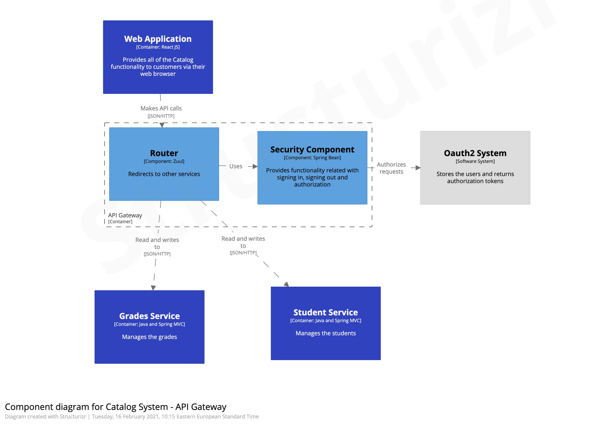

# Catalog Application

Catalog is an application that allows users to manage students and grades entities:

- See all students
- Add a new student
- Delete an existing student
- See all grades
- Add a new grade for a student

The application is secured using the Ouath2 service provided by Okta

# Architecture

## Context Diagram

## Container Diagram

## Component Diagram

- Focused on the Api Gateway

## Service-oriented Architecture Patterns

This application is composed of multiple Microservices patterns. 

Those are the following:
- API gateway - a service that provides each client with unified interface to services
- Discovery Server - a service that registers all services
- Access Token - a token that securely stores information about user that is exchanged between services
- Service instance per Container - deploy each service instance in its container
